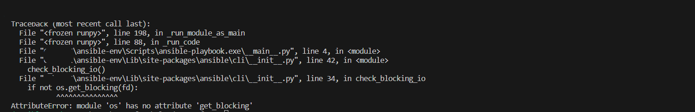
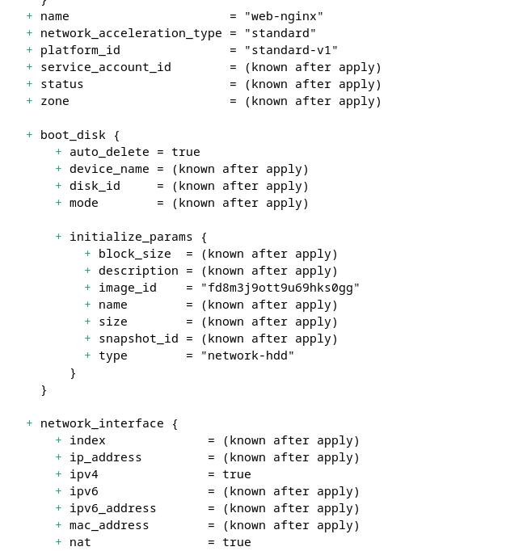
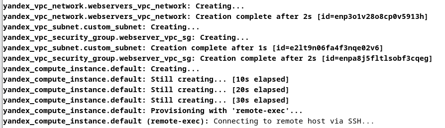
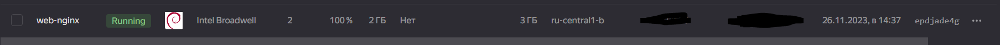

# Первый терраформ скрипт

Для разворачивания VM в yandex cloud потребуется:
* Желательно Unix совместимая ОС, т.к. на Windows при работе с ansible словил ошибку при обработке playbook'а: 
* Установить и настроить Terraform и  Yandex Cloud command-line interface -  https://cloud.yandex.com/en/docs/cli/quickstart#install
* Указать в variables.tf приватный и публичный ключи SSH, а также данные для подключения к yandex cloud -  token, id cloud и id folder

Скрины:

