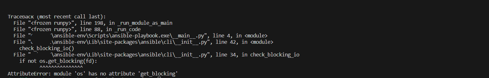

# Реализация GFS2 хранилища на виртуалках

Для разворачивания VM в yandex cloud потребуется:
* Желательно Unix совместимая ОС, т.к. на Windows при работе с ansible словил ошибку при обработке playbook'а: 
* Установить и настроить Terraform и  Yandex Cloud command-line interface -  https://cloud.yandex.com/en/docs/cli/quickstart#install
* Указать в variables.tf данные для подключения к yandex cloud -  token, id cloud и id folder
* Приблизительное время развертывания 15 минут
* SSH ключ будет сгененрирован автоматически, забрать можно будет из директории [ssh](/ssh/)
* Для подключения к серверам использвать УЗ - <code>cl-user</code> и внешний IP адрес сервера (будут выведены после окончания работы terramorf)
```
 ssh cl-user@<external_ip_address_*> -i id_rsa
```
* Проверяем, что всё собралось и работает корректно:
```
sudo pcs status --full
```
```
[cl-user@cl-node-2 ~]$ sudo pcs status --full
Cluster name: cluster-gfs
Cluster Summary:
  * Stack: corosync (Pacemaker is running)
  * Current DC: 10.2.100.4 (3) (version 2.1.6-9.1.el8-6fdc9deea29) - partition with quorum
  * Last updated: Wed Dec 13 21:16:47 2023 on 10.2.100.7
  * Last change:  Wed Dec 13 21:15:49 2023 by root via cibadmin on 10.2.100.3
  * 3 nodes configured
  * 12 resource instances configured

Node List:
  * Node 10.2.100.3 (1): online, feature set 3.17.4
  * Node 10.2.100.4 (3): online, feature set 3.17.4
  * Node 10.2.100.7 (2): online, feature set 3.17.4

Full List of Resources:
  * Clone Set: locking-clone [locking]:
    * Resource Group: locking:0:
      * dlm     (ocf::pacemaker:controld):       Started 10.2.100.7
      * lvmlockd        (ocf::heartbeat:lvmlockd):       Started 10.2.100.7
    * Resource Group: locking:1:
      * dlm     (ocf::pacemaker:controld):       Started 10.2.100.4
      * lvmlockd        (ocf::heartbeat:lvmlockd):       Started 10.2.100.4
    * Resource Group: locking:2:
      * dlm     (ocf::pacemaker:controld):       Started 10.2.100.3
      * lvmlockd        (ocf::heartbeat:lvmlockd):       Started 10.2.100.3
  * Clone Set: shared_vg-clone [shared_vg]:
    * Resource Group: shared_vg:0:
      * shared_lv       (ocf::heartbeat:LVM-activate):   Started 10.2.100.7
      * shared_fs       (ocf::heartbeat:Filesystem):     Started 10.2.100.7
    * Resource Group: shared_vg:1:
      * shared_lv       (ocf::heartbeat:LVM-activate):   Started 10.2.100.4
      * shared_fs       (ocf::heartbeat:Filesystem):     Started 10.2.100.4
    * Resource Group: shared_vg:2:
      * shared_lv       (ocf::heartbeat:LVM-activate):   Started 10.2.100.3
      * shared_fs       (ocf::heartbeat:Filesystem):     Started 10.2.100.3

Migration Summary:

Tickets:

PCSD Status:
  10.2.100.3: Online
  10.2.100.4: Online
  10.2.100.7: Online

Daemon Status:
  corosync: active/enabled
  pacemaker: active/enabled
  pcsd: active/enabled

```